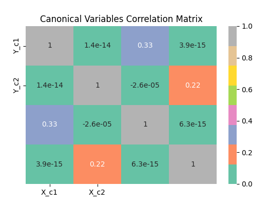
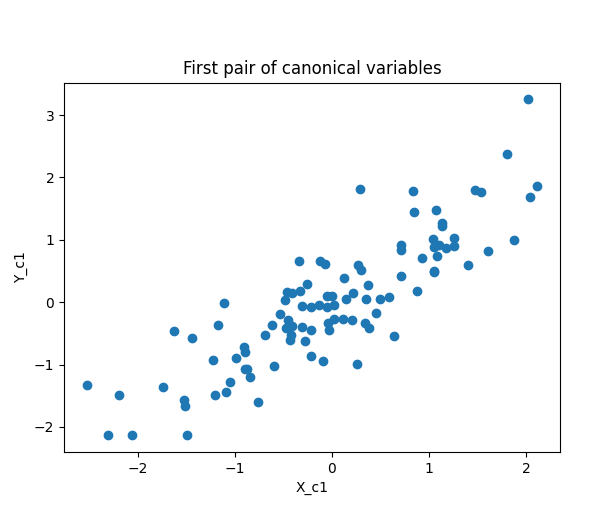

# WIP: Steady State Visually Evoked Potential Signal Analyzer (SSVEP)

This repository is dedicated to the development of an advanced signal processing tool for analyzing Steady State Visually Evoked Potentials (SSVEP). SSVEP are brain responses induced by visual stimuli at specific flickering frequencies, widely used in BCI systems. Our tool aims to provide robust analysis capabilities to enhance the interpretation and application of SSVEP in neuroscientific research and practical applications.

## Project Status

This project is currently in a work-in-progress stage. We are continuously refining our algorithms and improving the user interface.

## Features

- **Signal Processing**: Implementation of various signal processing techniques to clean and extract meaningful data from raw SSVEP signals.
- **CCA-Based Analysis**: Utilizes Canonical Correlation Analysis to match SSVEP signals against known templates, enhancing the accuracy of frequency recognition.
- **Filter Bank Approach**: Incorporates a filter bank to analyze multiple frequency bands, enabling more precise frequency detection and better handling of signal artifacts.
- **Cross-Platform Scripts**: Includes both MATLAB and Python scripts to facilitate analysis, accommodating users with different programming preferences.

## Dataset

The project utilizes a comprehensive SSVEP dataset, which has been converted into the `.h5` format to improve compatibility and performance in Python environments:
- **Description**: EEG recordings from subjects exposed to LED stimuli at varied frequencies. The data is now available in `.h5` format, allowing for efficient handling and processing in Python, alongside traditional MATLAB scripts.
- **Access**: The package provides the dataset.

## Getting Started

To begin using this project, clone the repository and follow the installation instructions below. The list of packages will become available.

```bash
git clone git@github.com:hesamjafarian/SSVEP.git
cd SSVEP
pip install -r requirements.txt
```

## Canonical Correlation Analysis Matrix


## Canonical Correlation Sample A1


## Canonical Correlation Sample A1

