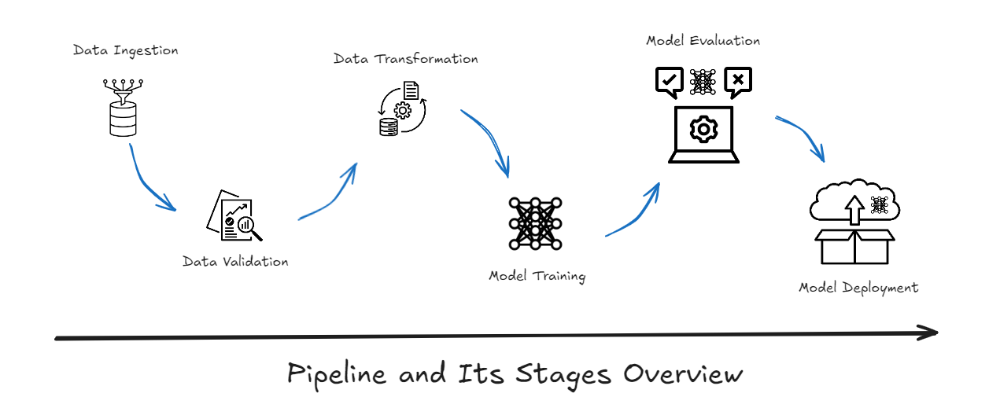
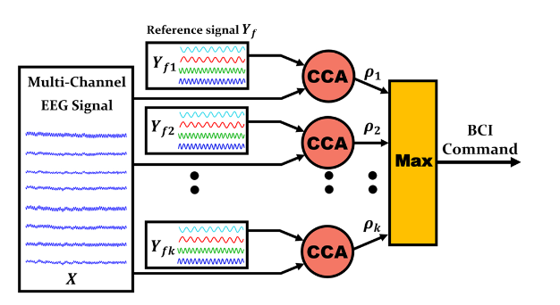

# WIP: Steady State Visually Evoked Potential Signal Analyzer (SSVEP)

This repository is dedicated to the development of an advanced signal processing tool for analyzing Steady State
Visually Evoked Potentials (SSVEP). SSVEP are brain responses induced by visual stimuli at specific flickering
frequencies, widely used in BCI systems. Our tool aims to provide robust analysis capabilities to enhance the
interpretation and application of SSVEP in neuroscientific research and practical applications.
http://biosigpro.xyz/overview.html#dataset

## Project Status

This project is currently in a work-in-progress stage. We are continuously refining our algorithms and improving the
user interface.

## Features

- **Signal Processing**: Implementation of various signal processing techniques to clean and extract meaningful data
  from raw SSVEP signals.
- **CCA-Based Analysis**: Utilizes Canonical Correlation Analysis to match SSVEP signals against known templates,
  enhancing the accuracy of frequency recognition.
- **Filter Bank Approach**: Incorporates a filter bank to analyze multiple frequency bands, enabling more precise
  frequency detection and better handling of signal artifacts.
- **Cross-Platform Scripts**: Includes both MATLAB and Python scripts to facilitate analysis, accommodating users with
  different programming preferences.

## Dataset

The project utilizes a comprehensive SSVEP dataset, which has been converted into the `.h5` format to improve
compatibility and performance in Python environments:

- **Description**: EEG recordings from subjects exposed to LED stimuli at varied frequencies. The data is now available
  in `.h5` format, allowing for efficient handling and processing in Python, alongside traditional MATLAB scripts.
- **Access**: The package provides the dataset.
- **Download**: You can download data from http://biosigpro.xyz/overview.html#dataset

## Pipeline and Its Stages Overview

- **Data Ingestion**: Collecting and loading data from sources (modifiable) into the system.

- **Data Validation**: Ensuring the quality and consistency of the ingested data by applying validation rules.

- **Data Transformation**: Preprocessing the data, including feature engineering and scaling, to make it suitable for model training.

- **Model Training**: Training machine learning models on the transformed data to create a predictive model.

- **Model Evaluation**: Assessing the performance of the trained model using different evaluation metrics.

- **Model Deployment**: Deploying the trained model on a cloud platform, such as **AWS (Amazon Web Services)**, to be accessed and used by the public or end-users via APIs or web services.

## Getting Started

To begin using this project, clone the repository and follow the installation instructions below. The list of packages
will become available.

```bash
git clone git@github.com:Biomeical-Signal-Processing/WIP-SSVEPA.git
cd WIP-SSVEPA
pip install -r requirements.txt
```

## Demonstration of EEG signal analysis using Canonical Correlation Analysis



## Canonical Correlation Analysis Matrix


## Canonical Correlation Sample A1


## Canonical Correlation Sample A1


## Workflows that is followed for each integration

1. Update config.yaml
2. Update schema.yaml
3. Update params.yaml
4. Update the entity
5. Update the configuration manager in src config
6. Update the components
7. Update the pipeline
8. Update the main.py
9. Update the app.py
